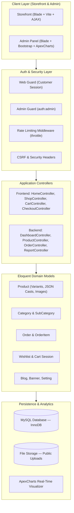
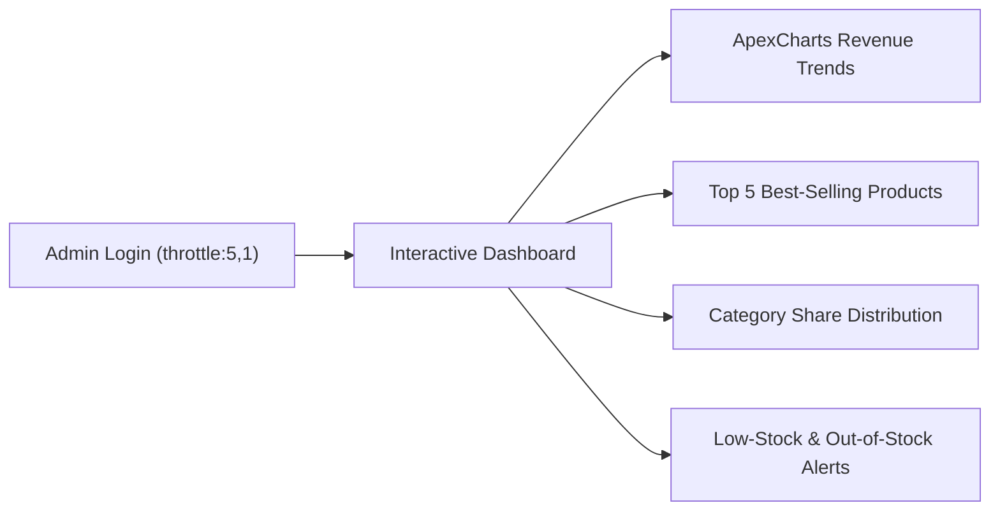
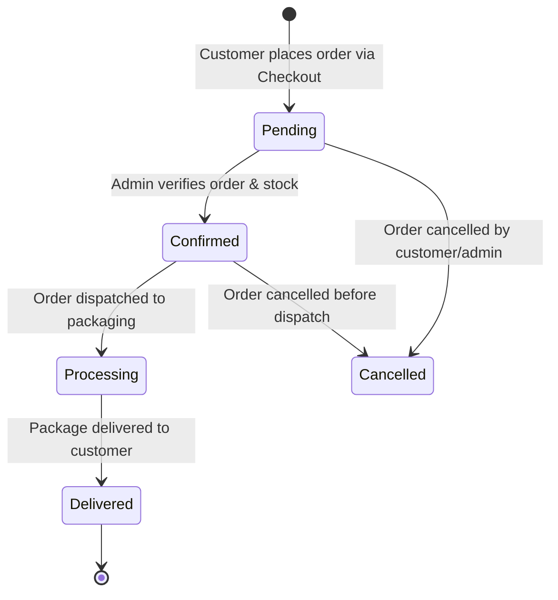

# 🛒 Innoflexia — Modern Full-Stack E-Commerce & Business Management Platform

[](https://laravel.com)
[](https://www.php.net/)
[](https://www.mysql.com/)
[](https://vitejs.dev/)
[]()
[]()

> **A production-ready, full-stack E-Commerce & Retail Management platform built with Laravel 12, PHP 8.2+, MySQL, Blade, and Vite — featuring a high-conversion storefront, dynamic product variants, session-driven cart and checkout pipeline, interactive ApexCharts business analytics, and a multi-guard administration control panel.**

---

## 📑 Table of Contents

1. [Platform Overview](#-platform-overview)
2. [System Architecture](#-system-architecture)
3. [Customer Storefront Features](#-customer-storefront-features)
4. [Admin Management & Business Analytics](#-admin-management--business-analytics)
5. [Order Lifecycle State Machine](#-order-lifecycle-state-machine)
6. [Database Schema & Entity Relationships](#-database-schema--entity-relationships)
7. [Security & Protection Architecture](#-security--protection-architecture)
8. [Tech Stack](#-tech-stack)
9. [Installation & Local Setup](#-installation--local-setup)
10. [Author & Contributions](#-author--contributions)

---

## 🛍️ Platform Overview

Innoflexia is an end-to-end e-commerce solution designed for retail brands, featuring two dedicated application interfaces:

```
┌────────────────────────────────────────────────────────────────────────┐
│                   Innoflexia E-Commerce Platform                       │
├───────────────────────────────────┬────────────────────────────────────┤
│       Customer Storefront         │        Admin Control Panel         │
│          (/, /shop, /cart)        │              (/admin)              │
├───────────────────────────────────┼────────────────────────────────────┤
│ • Dynamic Product Catalog         │ • ApexCharts Sales Analytics       │
│ • Multi-Variant (Size, Color, SKU)│ • Product & Multi-Image CRUD       │
│ • Real-time Search & Filter       │ • Category Hierarchy Management    │
│ • Persistent Cart & Wishlist      │ • Order State Machine & Invoicing  │
│ • Streamlined Checkout Pipeline   │ • Marketing Banners & Promo Grid   │
│ • Live Order Tracking Portal      │ • Blog CMS & Comment Moderation    │
│ • Blog CMS & Customer Inquiries   │ • Store Settings & Delivery Fees   │
└───────────────────────────────────┴────────────────────────────────────┘
```

---

## 🏛️ System Architecture



---

## 🛒 Customer Storefront Features

### 1. Product Discovery & Filtering
- **Dynamic Catalog:** Browse products categorized by primary and subcategory hierarchies.
- **Multi-Factor Filtering:** Filter by category, price range, stock availability, and promotional tags.
- **Curated Collections:** Quick toggles for **Featured Products**, **Hot Trends**, **Best Sellers**, and **New Arrivals**.
- **Live Search:** Instant keyword lookup across product titles, tags, and descriptions.

### 2. Product Variant Experience
- **Attribute Selectors:** Interactive size and color variant selectors stored via structured JSON casts (`sizes`, `colors`).
- **Multi-Image Showcase:** High-resolution product image gallery supporting up to 5 images per product.
- **Dynamic Pricing:** Real-time calculation showing original price, promotional discount price, and percentage savings.

### 3. Shopping Cart & Wishlist
- **Persistent Cart Engine:** Session-based cart supporting instant quantity adjustments, item removals, and real-time total recalculations.
- **AJAX Wishlist:** One-click wishlist toggling with dynamic count badges in the navigation bar without full page reloads.

### 4. Checkout & Order Tracking
- **Streamlined Checkout:** Direct guest and customer checkout capturing delivery address, contact details, and custom order notes.
- **Payment Modes:** Configured for **Cash on Delivery (COD)** with extensibility for online payment gateway integration.
- **Self-Service Order Tracking:** Dedicated `/order-track` portal allowing customers to check live dispatch status using their unique Order Number and Email.

---

## 📊 Admin Management & Business Analytics



### 1. Interactive Business Analytics (ApexCharts)
- **Revenue Performance:** Time-range filtered sales visualization (Weekly, Monthly, Yearly trends).
- **Product Velocity:** Top-earning products with unit sales and revenue metrics.
- **Inventory Health Monitor:** Instant identification of low-stock and depleted inventory items.
- **Category Breakdown:** Visual distribution of catalog volume across categories.

### 2. Product & Inventory Management
- Full CRUD operations with multi-image file handling.
- Instant stock quantity updates and active/inactive status toggles.
- Promotional badge assignment (`is_featured`, `is_hot_trend`, `is_best_seller`).
- SKU assignment and automated URL slug generation.

### 3. Category Hierarchy & Merchandising
- Multi-level Category and Subcategory relationships.
- Homepage Hero Banner and Promotional Discount Banner management.
- Dynamic Instagram Grid and Service Value Proposition management.

### 4. Content Marketing & Support CMS
- Full Blog Management with category classification.
- Customer comment moderation pipeline (Approve / Reject).
- Contact inquiry message inbox with read/unread tracking and direct response management.

---

## 🔄 Order Lifecycle State Machine

Every order progresses through a structured, auditable status pipeline:



- **Automated Order Number Generation:** Generates unique order references (e.g., `ORD-20260903-XXXX`).
- **Printable Invoices:** One-click HTML/PDF formatted order invoice generation for packing slips.

---

## 🗄️ Database Schema & Entity Relationships

```
categories
    └── sub_categories
            └── products
                    ├── order_items ── orders
                    └── wishlist

admins (auth:admin)
banners / discount_banners
blogs ── blog_categories ── blog_comments
contact_messages
settings (global store configuration)
```

### Key Schema Highlights
- **`products` Table:** Uses Eloquent JSON casting for `sizes`, `colors`, and `images` arrays, enabling flexible SKU variants without schema bloat.
- **`orders` & `order_items` Tables:** Normalized order header and line items with unit price snapshots at time of purchase.
- **`admins` Table:** Isolated administration credentials using a dedicated `auth:admin` guard.

---

## 🔐 Security & Protection Architecture

| Protection Layer | Implementation Details |
|---|---|
| **Authentication Separation** | Multi-guard architecture isolating public customer sessions from the `admin` guard. |
| **Brute-Force Rate Limiting** | `throttle:5,1` on Admin Login and `throttle:3,1` on Contact form submissions. |
| **SQL Injection Prevention** | 100% Eloquent ORM parameterized queries and prepared statements. |
| **Cross-Site Scripting (XSS)** | Blade auto-escaping syntax `{{ }}` on all user-generated content. |
| **CSRF Defense** | Automatic token validation across all state-changing HTTP `POST`, `PUT`, and `DELETE` routes. |
| **Password Security** | Bcrypt hashing with automated salt generation for all administrator accounts. |

---

## 💻 Tech Stack

| Layer | Technologies |
|---|---|
| **Backend Framework** | Laravel 12.x, PHP 8.2+ (MVC, Eloquent ORM, Multi-Guard Auth) |
| **Database** | MySQL 8.x (InnoDB, Foreign Key Constraints, Transactions) |
| **Frontend Architecture** | Blade Templates, Vite, Vanilla JavaScript ES6+, Bootstrap 4/5 |
| **Data Visualization** | ApexCharts JS (Interactive Revenue & Category Charts) |
| **Asset Pipeline** | Vite (Modern ES module bundler) |
| **Tooling** | Composer, NPM, Artisan CLI, PHPUnit |

---

## 🚀 Installation & Local Setup

### Prerequisites
- PHP `>= 8.2` with `intl`, `pdo_mysql`, `gd` extensions enabled
- Composer `>= 2.x`
- Node.js `>= 18.x` & NPM
- MySQL `>= 8.0`

### Step-by-Step Setup

1. **Clone the repository:**
   ```bash
   git clone https://github.com/ShakhawatSakib9/c-ecom.git
   cd c-ecom
   ```

2. **Install PHP and Node dependencies:**
   ```bash
   composer install
   npm install
   ```

3. **Configure Environment:**
   ```bash
   cp .env.example .env
   php artisan key:generate
   ```

4. **Configure Database in `.env`:**
   ```env
   DB_CONNECTION=mysql
   DB_HOST=127.0.0.1
   DB_PORT=3306
   DB_DATABASE=c_ecom
   DB_USERNAME=root
   DB_PASSWORD=
   ```

5. **Run Migrations and Seeders:**
   ```bash
   php artisan migrate --seed
   ```

6. **Create Public Storage Link:**
   ```bash
   php artisan storage:link
   ```

7. **Compile Assets & Launch Development Server:**
   ```bash
   npm run build
   php artisan serve
   ```
   - Storefront URL: `http://127.0.0.1:8000`
   - Admin Panel URL: `http://127.0.0.1:8000/admin`

---

## 👨‍💻 Author & Contributions

**Developed by Shakhawat Sakib**  
*Full-Stack Software Engineer · Laravel · PHP · MySQL · JavaScript*

- Portfolio: [github.com/ShakhawatSakib9](https://github.com/ShakhawatSakib9)
- LinkedIn: [linkedin.com/in/shakhawat-sakib](https://linkedin.com)
